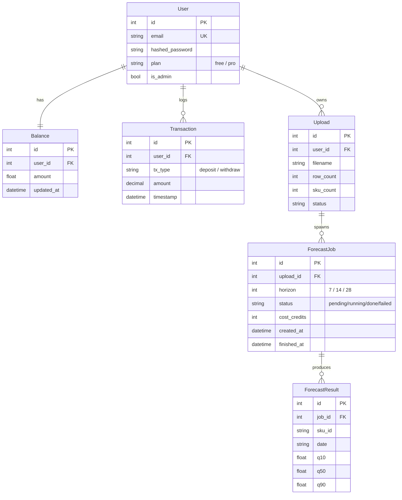

# MFDP — SaaS квантильного прогнозирования спроса

Сервис прогнозирования продаж для малого e-commerce. Пользователь загружает CSV
с историей продаж, получает прогноз на 7/14/28 дней с квантилями **0.1 / 0.5 / 0.9**
(нижняя оценка / медиана / страховой запас). Модель — **LightGBM v4** (38 признаков +
классификатор вероятности продажи), Mean Pinball **0.3167** на holdout (−20.3% vs Seasonal Naïve).

HW8 — упаковка MVP: доменная модель, PostgreSQL, REST API, UI, тесты, Docker,
масштабируемые воркеры.

## Архитектура

```
                         ┌─────────────┐
   Браузер ──► nginx ──► │  Streamlit  │ (UI :8501)
                  │      └─────────────┘
                  │             │ REST
                  ▼             ▼
            ┌──────────────────────┐      publish      ┌────────────┐
            │   FastAPI (api :8080) │ ───────────────►  │  RabbitMQ  │
            └──────────────────────┘                    └────────────┘
                  │                                            │ consume
                  ▼                                            ▼
            ┌────────────┐                          ┌────────────────────┐
            │ PostgreSQL │ ◄──────── запись ──────── │ worker × N (LGBM)  │
            └────────────┘   результатов + статуса   └────────────────────┘
```

Прогноз считается **асинхронно**: `/upload` сразу возвращает `job_id`, воркер
обрабатывает задачу из очереди и пишет результат в БД, UI опрашивает статус.
Это позволяет масштабировать воркеры независимо от API.

## Доменная модель (ER)



Загруженный CSV **не хранится** в БД — передаётся напрямую воркеру через очередь,
в базе остаются только метаданные загрузки и результаты прогноза.
Индекс `(job_id, sku_id, date)` на `forecast_results` — основной паттерн выборки.

## REST API

| Метод | URL | Описание |
|---|---|---|
| POST | `/api/users/signup` | регистрация (+200 бонус-кредитов) |
| POST | `/login/token` | вход, выдаёт JWT в httponly-cookie |
| GET/POST | `/api/balance/` | баланс / пополнение |
| POST | `/api/v1/upload` | загрузка CSV + horizon → `job_id` |
| GET | `/api/v1/jobs/{id}` | статус задачи |
| GET | `/api/v1/results/{id}` | результаты прогноза |
| GET | `/api/v1/health` | healthcheck |

Один прогноз стоит **50 кредитов** (списываются при постановке задачи, возврат при сбое очереди).

## Запуск

```bash
cp app/.env.example app/.env        # при необходимости поправить SECRET_KEY
docker compose up --build
```

- UI:        http://localhost:8501 (или http://localhost через nginx)
- API/docs:  http://localhost:8080/docs
- RabbitMQ:  http://localhost:15672 (guest/guest)

Демо-логин: `Demo@mail.ru` / `demo` (баланс 1000 кредитов).

### Масштабирование воркеров

```bash
docker compose up --scale worker=3
```

Все воркеры слушают одну durable-очередь `prediction_tasks` с `prefetch_count=1`
(competing consumers) — задачи распределяются между ними по одной.

## Формат входного CSV

```csv
date,sku_id,sales
2024-01-01,SKU_001,3
2024-01-02,SKU_001,0
...
```

Требования: колонки `date`, `sku_id`, `sales`; **минимум 60 дней** истории на SKU
(нужно для признака lag_56), иначе HTTP 400.

## Тесты

```bash
python -m pytest          # 24 теста: pinball, валидация CSV, sentinel, REST API
```

## Модель и версионирование

Артефакты модели (`ml_models/*.pkl`) монтируются в контейнеры как volume и
версионируются через **DVC** (`*.pkl.dvc` в git, бинарники — в DVC-кэше),
датасет M5 — там же. Источник моделей: `Homeworks/HW7/`.

## Ограничения MVP

- Модель обучена на M5 (Walmart, США). Признаки, которых нет в пользовательском
  CSV (цены, SNAP, события календаря США), заполняются нулями — точность на чужом
  домене ниже паспортной. Пайплайн работает end-to-end.
- `init_db` пересоздаёт демо-данные при старте; продовая миграция (alembic) вне scope.

## Стек

FastAPI · SQLModel · PostgreSQL · RabbitMQ (pika) · LightGBM · Streamlit · Docker · pytest
